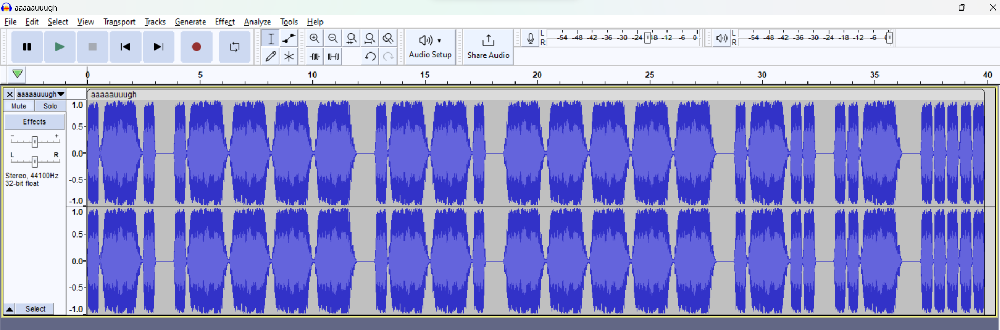

# Aaaaaaauuuggghhhh?
## Description
Wrap with NH4CK{}

Author: Souvlakia

# The challenge:
- We are given a `.wav` audio file.
- The file only has some `aaugh` sounds 🙃

# Solution:
- One may realize this by listening to the audio file but [Audacity](https://www.audacityteam.org) makes it clear as a bell.

**It is Morse Code!!**
- We manually then write down the dots and dashes of the audio file, and we get this:
 `.-. .---- .--. ----- .-.. ..- .....`.
- Translating from morse code using [Cyberchef](https://gchq.github.io/CyberChef/) or any other tool, we get:
`R1P0LU5`, which with flag wrapping becomes:
\
**`NH4CK{R1P0LU5}`**!!
