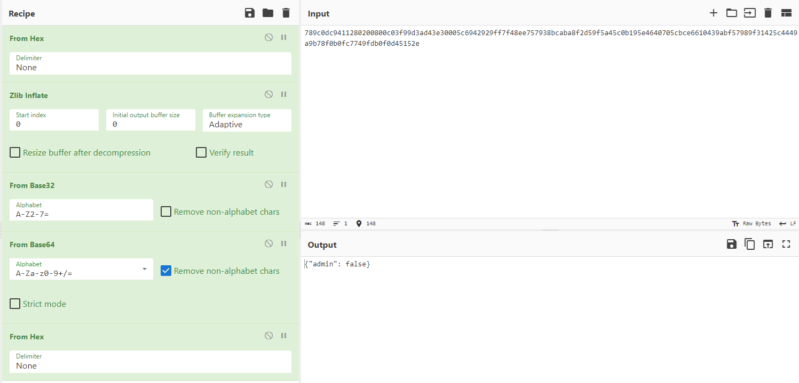
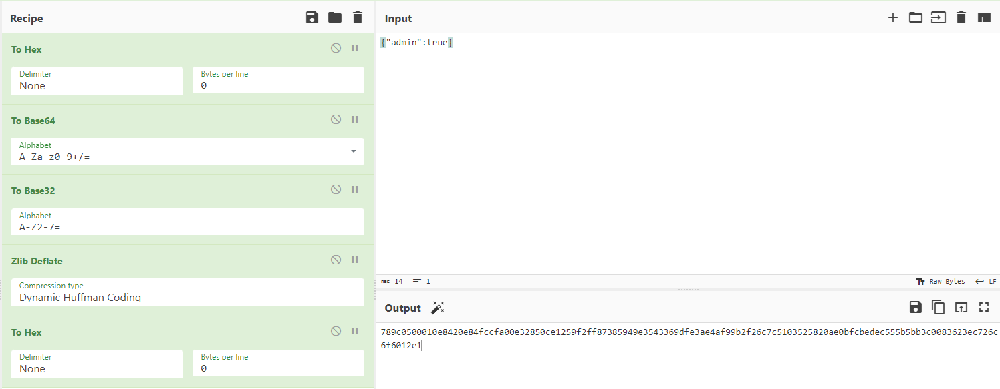
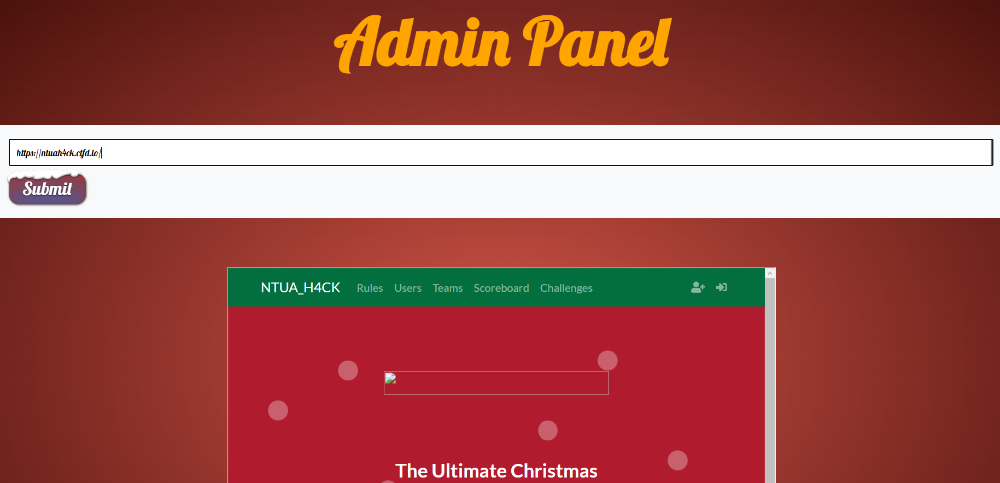
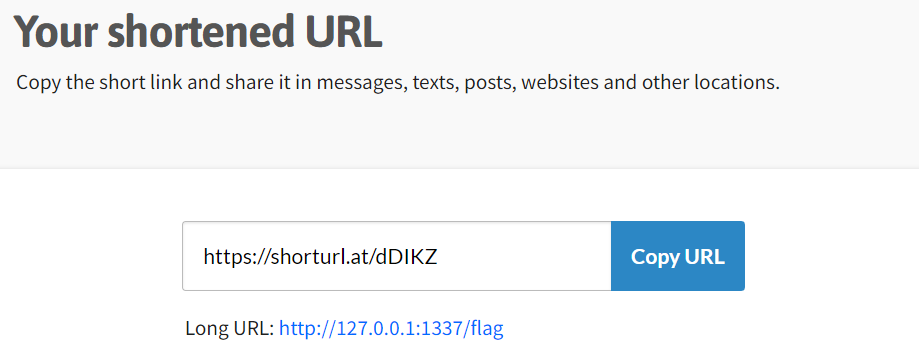
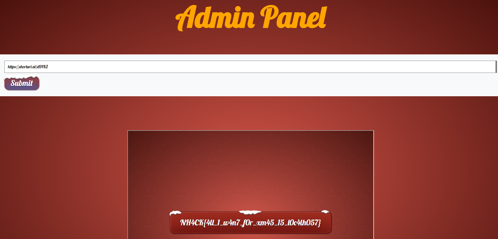

# xmas celebration
Is my flask app ready for production?

🥳🥳🎅🎄🎆🎈

Author: Souvlakia

# The challenge:
- We are given a link to a website that with first look seems like there is nothing interesting.

# Solution:
- Putting our web hacking knowledge in place, we check the `/robots.txt` in the url.
    Indeed we see that it does exist and we find 2 other paths of the website.
    `/panel` and `/flag`.
- Visiting `/flag`:
    
    Hm it seems that we aren't allowed to visit this page.
- Trying `/panel`:
    
    Interesting, let's see how the site knows if we are an admin or not.
    - Checking our cookies, we do indeed have a `token` cookie with value: `789c0dc9411280200800c03f99d3ad43e30005c6942929ff7f48ee757938bcaba8f2d59f5a45c0b195e4640705cbce6610439abf57989f31425c4449a9b78f0b0fc7749fdb0f0d45152e`
        This doesn't look like a [JWT cookie](https://jwt.io), so we try if [Cyberchef](https://gchq.github.io/CyberChef/) can decode it.
    - Gladly we see the magic wand  button appearing, and pressing it 3 times gives us the decoded cookie.
        
    - We forge our own `{"admin":true}` cookie by reversing the process.
        
        And we update our cookie in the browser with the new one.
        `789c0500010e8420e84fccfa00e32850ce1259f2ff87385949e3543369dfe3ae4af99b2f26c7c5103525820ae0bfcbedec555b5bb3c0083623ec726c6f6012e1`
- Visiting `/panel` again, we aren't faced with an error, but with a `Visit a url` functionality that as it says renders any url we specify: 
    
    - Keeping in mind that `/flag` noted that it is only available from internal network requests, it seems logical that we should request `http://127.0.0.1:PORT/flag` to get the flag page rendered to us by the website.
        - `127.0.0.1` is the usual local address of a network.
        - The `PORT` should be the port that the application is running internally and since we know from the description that its a non production flask application, we try `PORT=5000` which is the default.
        I guess not :( 
    - Checking the page source, we find this note from the developer:
    `<!-- NOTES -->`
    `<!-- application is running on port 1337, so i blocked the substring so noone can make internal requests -->`
    - Good news and bad news:
        We know now the port that the application runs at, but the page blocks any substring containing `1337`.
## Summary
- The flag is only available from internal requests.
- We have gained admin access to a `visit url` bot.
- App is running at port `1337`, but the substring is disallowed.
- We want a clever way to get the bot visit the desired link(`http://127.0.0.1:1337/flag`)

# Final exploit
- Good old [Redirection](https://en.wikipedia.org/wiki/URL_redirection) :D
- https://www.shorturl.at 

`NH4CK{4ll_1_w4n7_f0r_xm45_15_l0c4lh057}` 
🎄🎆🥳
