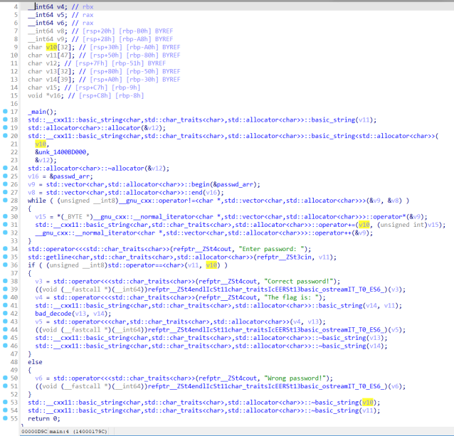
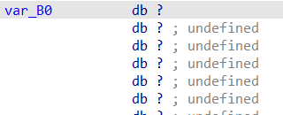
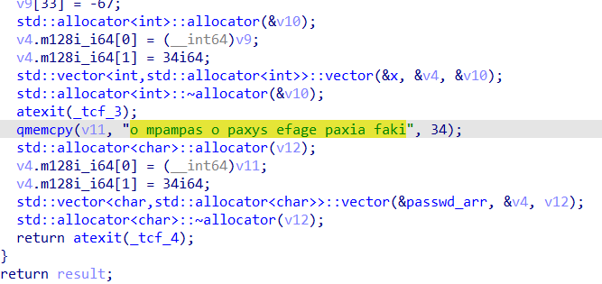
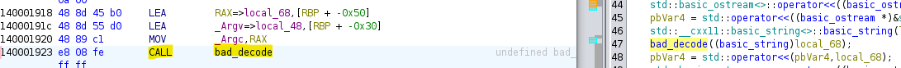
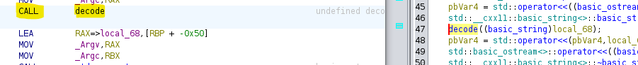
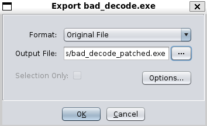
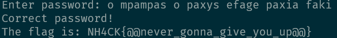

# bad decode
oops i called the wrong function

Author: Souvlakia

# The challenge:
- We are given a windows executable file that when we run it requests a password.
- We load it up to [IDA](https://hex-rays.com/ida-free/), and press `F5` to get the pseudocode of the `main` function. 
    - This seems to be a c++ binary, that checks the given password and then calls `bad_decode(input)`.
- Looking at `bad_decode`'s pseudocode  it is obvious that this a dummy function, and by searching if a `decode` function exists, we do find it. 

# Solution:
- Since the `decode` function seems to do operations on the given string parameter we need to find the correct password first, and then deal with decoding it.
    - Checking the bytes of the `v10` variable doesn't show anything 
    ,
    so let's search where the v10 string is initialized.
    - Searching the assembly code and functions we find this function that is called at the beginning of the program.
    
    - This function initializes some arrays and on the bottom we find our password in ascii text.
    `o mpampas o paxys efage paxia faki`
     *note that the `strings` command does not print the password since it is not actually initialized in character format in the binary. IDA simply recognized the integer array to be ascii and displayed it like that*. Thnx IDA :)
- Running the binary with the correct password, passes the check and we see the value of the `bad_decode` function being returned.
    

## Up to now
- The program asks us for the password and if correct, calls a wrong function to decode.
- Our goal is either to reverse the decode proccess, or modify the binary to call the correct function instead.

# Final exploit
- Patching the binary, so it calls the `decode` function, rather than `bad_decode` is the easiest solution here.
- I will be using [Ghidra](https://ghidra-sre.org) for the patching since I don't know how to do it in IDA 🙃
    - We locate the `call bad_decode`  and with `right click` &rarr;  
    we change it to `call decode`: 

    - Then we export the patched binary as original file 
    run it and enter the password.
     

`NH4CK{@@never_gonna_give_you_up@@}` 
